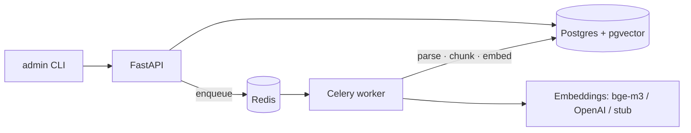

# DocQA

**Ask questions about your documents. Get answers with page-level citations — or an honest "not found".**

Multi-tenant document Q&A API built on FastAPI, PostgreSQL + pgvector, Redis and Celery. Upload PDF / DOCX / Markdown, and DocQA parses, chunks and embeds them in the background — ready for hybrid retrieval and grounded, citation-backed answers.

> 🚧 **Work in progress.** Milestone 1 of 4 is complete: multi-tenant foundation and the full ingestion pipeline. Retrieval + generation with citations, production hardening (rate limiting, idempotency, CI, Docker) and a web UI with a public demo are next.

## What works today

- **Multi-tenant API** — API keys (`dqa_live_…`, sha256-at-rest, shown once), tenant-scoped resources, admin CLI
- **Collections** — group documents; each collection pins its embedding model
- **Document upload** — streaming multipart with on-the-fly sha256, size limit (413), magic-byte type detection (415), duplicate detection via DB constraint (409 with the existing document id)
- **Background ingestion** — Celery worker: parse → section-aware chunking → embeddings → bulk insert; document status `pending → processing → ready | failed` observable via API
- **Parsers** — PDF (PyMuPDF, font-size heading heuristics → section breadcrumbs), DOCX (headings + tables converted to Markdown), MD, TXT
- **Chunking** — section-bounded sliding window (~450 tokens, 60 overlap, hard cap 512), sentence-boundary aware, page ranges preserved
- **Embedding providers** — OpenAI (`text-embedding-3-small@1024`), Ollama (`bge-m3`), and a deterministic stub: tests and offline mode need zero API keys
- **Ops hygiene** — fail-fast config, structured JSON logs with `request_id`, RFC 9457 problem+json errors, additive Alembic migrations, ruff + strict mypy, unit & integration tests (testcontainers)

## Architecture



- **One database** for metadata, chunks, vectors (HNSW) and full-text (`tsvector`) — transactional consistency, one thing to deploy.
- **Async SQLAlchemy** in the API, **sync** engine in the worker — Celery tasks stay loop-free.
- **Everything external is a `Protocol`** with a stub implementation — the whole test suite runs offline.

## Quickstart

Requires Docker and [uv](https://docs.astral.sh/uv/).

```bash
cp .env.example .env          # defaults work out of the box (stub embeddings)
docker compose up -d          # Postgres (host port 5433) + Redis
uv sync
uv run alembic upgrade head

# create a tenant and an API key (key is printed once)
uv run python -m app.cli create-tenant --name acme
uv run python -m app.cli create-key --tenant-id <tenant-uuid>

# run the API and the ingestion worker
uv run uvicorn app.main:app --reload --no-access-log
uv run celery -A app.workers.celery_app worker -Q ingestion -c 2
```

Upload a document and watch it become queryable:

```bash
export KEY=dqa_live_...

curl -s -X POST localhost:8000/v1/collections \
  -H "Authorization: Bearer $KEY" -H "Content-Type: application/json" \
  -d '{"name": "Policies"}'

curl -s -X POST localhost:8000/v1/collections/<collection-id>/documents \
  -H "Authorization: Bearer $KEY" -F "file=@handbook.pdf"
# → 202 {"id": "…", "status": "pending"}

curl -s localhost:8000/v1/documents/<document-id> -H "Authorization: Bearer $KEY"
# → {"status": "ready", "page_count": 12, …}
```

Interactive docs: http://localhost:8000/docs

## Configuration

Copy `.env.example` and adjust. Highlights:

| Variable | Default | Purpose |
|---|---|---|
| `DATABASE_URL` | — (required) | asyncpg DSN for the API |
| `DATABASE_URL_SYNC` | derived | psycopg DSN for the worker |
| `REDIS_URL` | — (required) | Celery broker & app cache |
| `EMBEDDING_PROVIDER` | `stub` | `stub` \| `openai` \| `ollama` |
| `EMBEDDING_DIM` | `1024` | fixed vector dimension |
| `OLLAMA_BASE_URL` | `http://localhost:11434` | for `ollama` provider (`bge-m3`) |
| `OPENAI_API_KEY` | — | for `openai` provider |
| `MAX_UPLOAD_MB` | `25` | upload size cap → 413 |
| `MAX_PAGES` | `300` | PDF page cap → 422 |

## Design decisions

- **pgvector in the main DB, not a dedicated vector store** — transactional with metadata, one instance to run; HNSW is plenty at this scale (see Known limits).
- **Fixed 1024-dim embeddings** — native for `bge-m3`, supported by OpenAI via matryoshka `dimensions=1024`; one column covers all providers, `collections.embedding_model` prevents mixing.
- **Dedup via unique constraint, not SELECT-then-INSERT** — the DB wins the race; concurrent identical uploads yield exactly one document and a 409.
- **`tsvector` with the `'simple'` config** — the corpus is bilingual (EN/DE); language-specific stemming would break one of them. Precision loss is compensated by vectors + reranking (week 2).
- **Foreign tenant's resource → 404, not 403** — a 403 confirms the resource exists; that's an information leak.
- **Parser errors don't retry** — the file will not become more valid; transient (network/provider) errors retry with exponential backoff.

## Known limits

- pgvector/HNSW is the right tool up to roughly ~10M vectors; beyond that, revisit (partitioning or a dedicated vector DB).
- Files are stored on local disk behind a `StorageProtocol` — S3/MinIO is a drop-in later, not a rewrite.
- Heading detection in PDFs is heuristic (font-size clustering); exotic layouts degrade gracefully to flat chunking.

## Roadmap

- **Retrieval & answers** — hybrid search (vector + FTS + RRF), reranking, LLM answers strictly from documents with `[n]` citations mapped to file + pages, SSE streaming, cheap refusals (no LLM call when retrieval comes up empty)
- **Production hardening** — per-key rate limiting (429 + `Retry-After`), `Idempotency-Key` replay, tenant-isolation test matrix, multi-stage Docker image, GitHub Actions CI
- **Demo & eval** — seeded demo corpus with engineered traps (version conflicts, cross-doc answers), golden-set eval (recall@8, citation precision, faithfulness), Next.js UI, live demo
