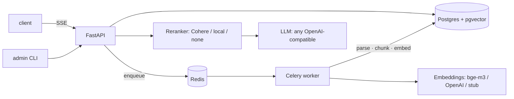

# DocQA

**Ask questions about your documents. Get answers with page-level citations — or an honest "not found".**

Multi-tenant document Q&A API built on FastAPI, PostgreSQL + pgvector, Redis and Celery. Upload PDF / DOCX / Markdown, and DocQA parses, chunks and embeds them in the background — ready for hybrid retrieval and grounded, citation-backed answers.

> 🚧 **Work in progress.** Milestones 1–3 of 4 are complete: multi-tenant foundation, the full ingestion pipeline, grounded question answering with citations over SSE, and production hardening (rate limiting, idempotency, Docker, CI). A web UI, eval harness and a public demo are next.

## What works today

**Ask questions, get grounded answers:**

- **Hybrid retrieval** — pgvector HNSW (cosine) + Postgres FTS fused with Reciprocal Rank Fusion; optional reranking (Cohere `rerank-v3.5`, local `bge-reranker-v2-m3`, or none)
- **Cheap honest refusals** — an off-corpus question is refused *before* the LLM is called (retrieval gate, $0); a model-side `NO_ANSWER` is intercepted mid-stream and converted to a refusal (generation gate)
- **Citations that resolve** — every `[n]` maps to a document, page range, section breadcrumbs and snippet; out-of-range citations are stripped before the answer is final
- **SSE streaming** — `meta → sources → delta… → done`; sources arrive *before* the first token, so you see where the answer will come from earlier than the answer. Plain JSON mode for API clients
- **Any OpenAI-compatible LLM** — one provider class covers OpenAI, DeepSeek, Ollama and vLLM via `base_url`; Anthropic planned
- **Usage accounting** — every query (refusals included) records tokens, cost, latency and its context blocks

**Feed it documents:**

- **Multi-tenant API** — API keys (`dqa_live_…`, sha256-at-rest, shown once), tenant-scoped resources, admin CLI
- **Document upload** — streaming multipart with on-the-fly sha256, size limit (413), magic-byte type detection (415), duplicate detection via DB constraint (409 with the existing document id)
- **Background ingestion** — Celery worker: parse → section-aware chunking (~450 tokens, 60 overlap, tables kept atomic) → embeddings → bulk insert; status `pending → processing → ready | failed`
- **Parsers** — PDF (PyMuPDF, font-size heading heuristics → section breadcrumbs), DOCX (headings + tables → Markdown), MD, TXT
- **Embedding providers** — OpenAI (`text-embedding-3-small@1024`), Ollama (`bge-m3`), and a deterministic stub: tests and offline mode need zero API keys
**Run it like a service:**

- **Per-key rate limiting** — Redis token bucket (atomic Lua), per endpoint class (query 30/min, upload 10/min, default 120/min); 429 with `Retry-After` and `X-RateLimit-*`; fails open when Redis is down (availability beats quota enforcement)
- **Idempotency** — `Idempotency-Key` on uploads and non-streaming queries: concurrent duplicate → 409 `request_in_flight`, repeat → stored response replayed with `X-Idempotency-Replay: true`
- **Strict tenant isolation** — every query carries the tenant scope in its WHERE clause; a foreign resource is indistinguishable from a missing one (404, never 403); covered by an IDOR test matrix and a concurrent-dedup race test
- **Docker** — multi-stage uv image, non-root; `docker-compose.prod.yml` runs api + worker + Postgres + Redis with healthchecks, DB/Redis ports unpublished, `noeviction` Redis (a broker must never drop messages)
- **CI** — GitHub Actions: ruff, strict mypy, full test suite (testcontainers) with an 80% coverage gate on core modules (currently ~89%); Dependabot for deps and actions
- **Ops hygiene** — fail-fast config, structured JSON logs with `request_id`, RFC 9457 problem+json errors everywhere, additive Alembic migrations, `/v1/usage` aggregates, 71 tests

## Architecture



- **One database** for metadata, chunks, vectors (HNSW) and full-text (`tsvector`) — transactional consistency, one thing to deploy.
- **Async SQLAlchemy** in the API, **sync** engine in the worker — Celery tasks stay loop-free.
- **Everything external is a `Protocol`** with a stub implementation — the whole test suite runs offline.

## Quickstart

Requires Docker and [uv](https://docs.astral.sh/uv/).

```bash
cp .env.example .env          # defaults work out of the box (stub embeddings)
docker compose up -d          # Postgres (host port 5433) + Redis
uv sync
uv run alembic upgrade head

# create a tenant and an API key (key is printed once)
uv run python -m app.cli create-tenant --name acme
uv run python -m app.cli create-key --tenant-id <tenant-uuid>

# run the API and the ingestion worker
uv run uvicorn app.main:app --reload --no-access-log
uv run celery -A app.workers.celery_app worker -Q ingestion -c 2
```

Upload a document and watch it become queryable:

```bash
export KEY=dqa_live_...

curl -s -X POST localhost:8000/v1/collections \
  -H "Authorization: Bearer $KEY" -H "Content-Type: application/json" \
  -d '{"name": "Policies"}'

curl -s -X POST localhost:8000/v1/collections/<collection-id>/documents \
  -H "Authorization: Bearer $KEY" -F "file=@handbook.pdf"
# → 202 {"id": "…", "status": "pending"}

curl -s localhost:8000/v1/documents/<document-id> -H "Authorization: Bearer $KEY"
# → {"status": "ready", "page_count": 12, …}
```

Ask a question (SSE stream):

```bash
curl -N -X POST localhost:8000/v1/query \
  -H "Authorization: Bearer $KEY" -H "Content-Type: application/json" \
  -d '{"collection_id": "<collection-id>", "question": "How many vacation days do employees get?"}'

# event: meta     {"query_id": "…"}
# event: sources  {"sources": [{"n": 1, "filename": "handbook.pdf", "pages": [3, 4], …}]}
# event: delta    {"text": "Employees receive 27 vacation days per year [1]"}
# event: done     {"answer": "…", "refused": false, "confidence": 0.91,
#                  "usage": {"prompt_tokens": 2810, "completion_tokens": 142, "cost_usd": 0.0007}, …}
```

Or plain JSON (`"stream": false`) — same pipeline, one response. A question the documents can't answer returns `"refused": true` instead of a hallucination — and in most cases without spending a single LLM token.

Interactive docs: http://localhost:8000/docs

### Production-shaped stack

```bash
docker compose -f docker-compose.prod.yml up -d --build   # api + worker + db + redis
```

Single multi-stage image (non-root), migrations on start, healthchecked dependencies, database and Redis not exposed to the host.

## Configuration

Copy `.env.example` and adjust. Highlights:

| Variable | Default | Purpose |
|---|---|---|
| `DATABASE_URL` | — (required) | asyncpg DSN for the API |
| `DATABASE_URL_SYNC` | derived | psycopg DSN for the worker |
| `REDIS_URL` | — (required) | Celery broker & app cache |
| `EMBEDDING_PROVIDER` | `stub` | `stub` \| `openai` \| `ollama` |
| `EMBEDDING_DIM` | `1024` | fixed vector dimension |
| `OLLAMA_BASE_URL` | `http://localhost:11434` | for `ollama` provider (`bge-m3`) |
| `OPENAI_API_KEY` | — | for `openai` provider |
| `LLM_PROVIDER` | `stub` | `openai_compat` \| `stub` |
| `LLM_BASE_URL` / `LLM_MODEL` | OpenAI | any OpenAI-compatible endpoint (DeepSeek, Ollama `/v1`, vLLM) |
| `RERANK_PROVIDER` | `none` | `cohere` \| `local` \| `none` \| `stub` |
| `REFUSAL_THRESHOLD` | `0.35` | rerank score below this → refuse without an LLM call |
| `RATE_LIMIT_ENABLED` | `true` | per-key token buckets (query 30/min, upload 10/min, default 120/min) |
| `MAX_UPLOAD_MB` | `25` | upload size cap → 413 |
| `MAX_PAGES` | `300` | PDF page cap → 422 |

## Design decisions

- **pgvector in the main DB, not a dedicated vector store** — transactional with metadata, one instance to run; HNSW is plenty at this scale (see Known limits).
- **RRF instead of weighted score fusion** — cosine similarity and `ts_rank` live on incomparable scales; RRF works on ranks alone, needs no normalization or weight tuning, and a chunk found by both searches naturally rises to the top.
- **Refusals are engineered, not hoped for** — two gates: retrieval (top rerank score below threshold → refuse for $0, no LLM call) and generation (the model's `NO_ANSWER` is buffered and intercepted before a single token reaches the client).
- **Sources stream before the answer** — the user sees *where* the answer will come from before the answer itself; trust is the product.
- **Fixed 1024-dim embeddings** — native for `bge-m3`, supported by OpenAI via matryoshka `dimensions=1024`; one column covers all providers, `collections.embedding_model` prevents mixing.
- **Dedup via unique constraint, not SELECT-then-INSERT** — the DB wins the race; concurrent identical uploads yield exactly one document and a 409.
- **`tsvector` with the `'simple'` config** — the corpus is bilingual (EN/DE); language-specific stemming would break one of them. FTS supplies exact matches (IDs, numbers); semantics is the vector's job.
- **Foreign tenant's resource → 404, not 403** — a 403 confirms the resource exists; that's an information leak.
- **Parser errors don't retry** — the file will not become more valid; transient (network/provider) errors retry with exponential backoff.
- **Query stats survive disconnects** — recording runs in a cancellation-shielded `finally`; a closed laptop lid doesn't lose usage data.

## Known limits

- pgvector/HNSW is the right tool up to roughly ~10M vectors; beyond that, revisit (partitioning or a dedicated vector DB).
- Files are stored on local disk behind a `StorageProtocol` — S3/MinIO is a drop-in later, not a rewrite.
- Heading detection in PDFs is heuristic (font-size clustering); exotic layouts degrade gracefully to flat chunking.

## Roadmap

- **Demo & eval** — seeded demo corpus with engineered traps (version conflicts, cross-doc answers), golden-set eval (recall@8, citation precision, faithfulness), Next.js UI, live demo
- **Nice-to-haves** — Anthropic streaming provider, Prometheus metrics, Sentry
