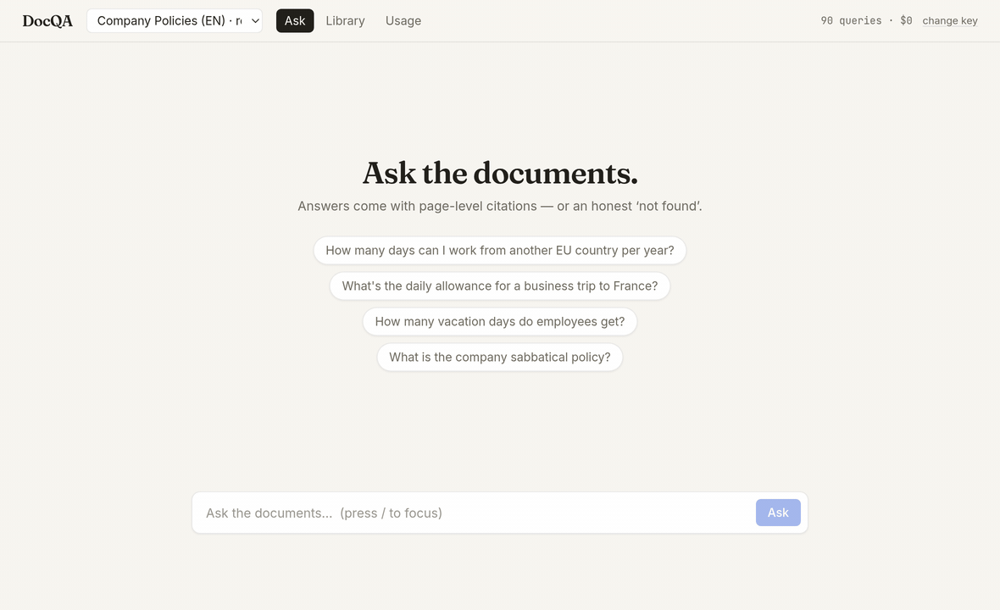

# DocQA

[](https://github.com/Hortenh1x/docqa/actions/workflows/ci.yml)


**Ask questions about your documents. Get answers with page-level citations — or an honest "not found".**



Multi-tenant document Q&A API built on FastAPI, PostgreSQL + pgvector, Redis and Celery. Upload PDF / DOCX / Markdown; DocQA parses, chunks and embeds them in the background, then answers over hybrid retrieval (vector + FTS + RRF) with SSE streaming, two refusal gates and citations that resolve to pages and sections.

Measured on a 447-question golden set over a trap-engineered corpus ([details](docs.md#measured-not-promised)): recall@8 **0.99**, faithfulness **100%**, correctness **97.8%**, citation precision **99.6%**, **zero invented answers** on 150 off-corpus questions.

- **[docs.md](docs.md)** — features, eval results, architecture, configuration, design decisions
- **[deploy/runbook.md](deploy/runbook.md)** — public-demo deploy (Caddy TLS, quotas, backups)

## Quickstart

Requires Docker and [uv](https://docs.astral.sh/uv/).

Everything in one command (Ctrl+C stops it all): `./scripts/dev.sh`. Step by step:

```bash
cp .env.example .env          # defaults work out of the box (stub embeddings)
docker compose up -d          # Postgres (host port 5433) + Redis
uv sync
uv run alembic upgrade head

# create a tenant and an API key (key is printed once)
uv run python -m app.cli create-tenant --name acme
uv run python -m app.cli create-key --tenant-id <tenant-uuid>

# run the API and the ingestion worker
uv run uvicorn app.main:app --reload --no-access-log
uv run celery -A app.workers.celery_app worker -Q ingestion -c 2
```

Upload a document and watch it become queryable:

```bash
export KEY=dqa_live_...

curl -s -X POST localhost:8000/v1/collections \
  -H "Authorization: Bearer $KEY" -H "Content-Type: application/json" \
  -d '{"name": "Policies"}'

curl -s -X POST localhost:8000/v1/collections/<collection-id>/documents \
  -H "Authorization: Bearer $KEY" -F "file=@handbook.pdf"
# → 202 {"id": "…", "status": "pending"}

curl -s localhost:8000/v1/documents/<document-id> -H "Authorization: Bearer $KEY"
# → {"status": "ready", "page_count": 12, …}
```

Ask a question (SSE stream):

```bash
curl -N -X POST localhost:8000/v1/query \
  -H "Authorization: Bearer $KEY" -H "Content-Type: application/json" \
  -d '{"collection_id": "<collection-id>", "question": "How many vacation days do employees get?"}'

# event: meta     {"query_id": "…"}
# event: sources  {"sources": [{"n": 1, "filename": "handbook.pdf", "pages": [3, 4], …}]}
# event: delta    {"text": "Employees receive 27 vacation days per year [1]"}
# event: done     {"answer": "…", "refused": false, "confidence": 0.91,
#                  "usage": {"prompt_tokens": 2810, "completion_tokens": 142, "cost_usd": 0.0007}, …}
```

Or plain JSON (`"stream": false`) — same pipeline, one response. A question the documents can't answer returns `"refused": true` instead of a hallucination — usually without spending a single LLM token.

Interactive docs: http://localhost:8000/docs · Web UI: `npm --prefix ui run dev` → http://localhost:3002

### Demo corpus and eval

```bash
uv run python -m scripts.build_corpus     # md -> PDF/DOCX (no pandoc needed)
uv run python -m scripts.seed_demo        # tenant + collections through the API
uv run python -m eval.run_eval --collection <policies-en id>   # reproduce the numbers
```

Everything else — measured results, architecture, configuration, design decisions, known limits — lives in **[docs.md](docs.md)**.
