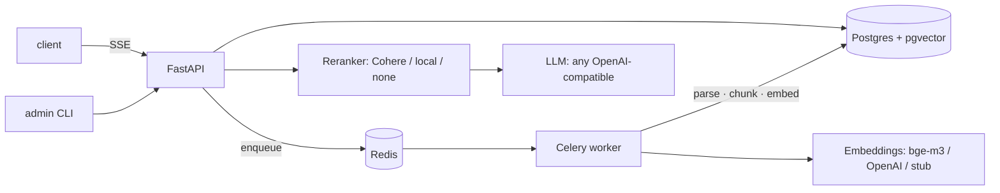

# DocQA — full documentation

The [README](README.md) covers the quick start; this file holds everything else: features, measured evaluation results, architecture, configuration and design decisions. Deployment lives in [deploy/runbook.md](deploy/runbook.md).

## What works today

**Ask questions, get grounded answers:**

- **Hybrid retrieval** — pgvector HNSW (cosine) + Postgres FTS fused with Reciprocal Rank Fusion; optional reranking (Cohere `rerank-v3.5`, local `bge-reranker-v2-m3`, or none)
- **Cheap honest refusals** — an off-corpus question is refused *before* the LLM is called (retrieval gate, $0); a model-side `NO_ANSWER` is intercepted mid-stream and converted to a refusal (generation gate)
- **Citations that resolve** — every `[n]` maps to a document, page range, section breadcrumbs and snippet; out-of-range citations are stripped before the answer is final
- **SSE streaming** — `meta → sources → delta… → done`; sources arrive *before* the first token, so you see where the answer will come from earlier than the answer. Plain JSON mode for API clients
- **Any OpenAI-compatible LLM** — one provider class covers OpenAI, DeepSeek, Ollama and vLLM via `base_url`; Anthropic planned
- **Usage accounting** — every query (refusals included) records tokens, cost, latency, the access role and its context blocks
- **Access-aware retrieval** — sections of a document can be restricted to a group (`Access: Finance only` in the text); every chunk carries that label and retrieval filters on it *in the WHERE clause* before ranking, so a restricted passage never reaches the prompt, the sources or the citations. The caller states its role (`role` on `POST /v1/query`, roles from `GET /v1/roles`); in demo reveal mode the response also says how many relevant passages the role could not see and which group unlocks them. Details below

**Feed it documents:**

- **Multi-tenant API** — API keys (`dqa_live_…`, sha256-at-rest, shown once), tenant-scoped resources, admin CLI
- **Document upload** — streaming multipart with on-the-fly sha256, size limit (413), magic-byte type detection (415), duplicate detection via DB constraint (409 with the existing document id)
- **Background ingestion** — Celery worker: parse → section-aware chunking (~450 tokens, 60 overlap, tables kept atomic) → embeddings → bulk insert; status `pending → processing → ready | failed`
- **Parsers** — PDF (PyMuPDF, font-size heading heuristics → section breadcrumbs), DOCX (headings + tables → Markdown), MD, TXT
- **Embedding providers** — OpenAI (`text-embedding-3-small@1024`), Ollama (`bge-m3`), and a deterministic stub: tests and offline mode need zero API keys
- **Suggested questions** — once a collection's ingestion settles, the answering LLM drafts starter questions from a corpus sample (count+2 candidates, ranked by their own retrieval score so the least grounded fall off; corpus-language aware — the German set gets German questions); each question carries the least-privileged role that can answer it (`min_role`), and a collection with restricted content always gets at least one locked question; stored on the collection, refreshed after uploads/deletes, cleared on wipe
- **Ingestion progress & cost** — `GET /v1/collections/{id}/ingest-status`: document counts by status, tokens embedded so far priced at the collection's embedding model (e.g. the whole 21-doc demo corpus ≈ $0.0004 on `text-embedding-3-small`), and an ETA for in-flight documents derived from recently measured throughput

**Run it like a service:**

- **Per-key rate limiting** — Redis token bucket (atomic Lua), per endpoint class (query 30/min, upload 10/min, default 120/min); 429 with `Retry-After` and `X-RateLimit-*`; fails open when Redis is down (availability beats quota enforcement)
- **Demo cost cap** — optional daily query quota per (api key, client address), so a public demo where every visitor shares one key still bounds spend per visitor: at `deepseek-v4-flash` prices a worst-case query is ~$0.001, so `RATE_LIMIT_QUERY_PER_DAY=900` keeps one visitor under **$1/day**; 429 `daily_quota_exceeded` with `Retry-After` to UTC midnight and `X-Quota-Daily-*` headers
- **Idempotency** — `Idempotency-Key` on uploads and non-streaming queries: concurrent duplicate → 409 `request_in_flight`, repeat → stored response replayed with `X-Idempotency-Replay: true`
- **Strict tenant isolation** — every query carries the tenant scope in its WHERE clause; a foreign resource is indistinguishable from a missing one (404, never 403); covered by an IDOR test matrix and a concurrent-dedup race test
- **Docker** — multi-stage uv image, non-root; `docker-compose.prod.yml` runs api + worker + Postgres + Redis with healthchecks, DB/Redis ports unpublished, `noeviction` Redis (a broker must never drop messages)
- **CI** — GitHub Actions: ruff, strict mypy, full test suite (testcontainers) with an 80% coverage gate on core modules (currently ~89%); Dependabot for deps and actions
- **Ops hygiene** — fail-fast config, structured JSON logs with `request_id`, RFC 9457 problem+json errors everywhere, additive Alembic migrations, `/v1/usage` aggregates, 77 tests

**Use it from a browser:**

- **Next.js UI** ([ui/](ui/)) — an "archivist's desk" interface: each collection's own suggested questions as starter chips (LLM-generated after ingestion; no static fallback — an empty collection shows no chips; a lock marks questions the current role cannot answer), a "Viewing as" role switch in the top bar, sources rendered *before* the answer streams (restricted passages wear their group's tag), inline citation stamps that open a source panel (file, pages, section, access, highlighted snippet), refusals as a first-class amber state — including "not available at your access level" with a one-click "View as Finance" — a library screen with upload, live ingestion statuses, per-document access tags and a progress line (ETA + embedded tokens + running cost + restricted passages). `cd ui && npm install && npm run dev` against a running API.

## Measured, not promised

The repo ships a synthetic corpus (21 corporate policy documents, EN+DE) with deliberately engineered traps — a version conflict, cross-document answers, an exception buried mid-section, near-duplicate policies, five guaranteed knowledge gaps — plus two golden sets:

- [eval/golden.yaml](eval/golden.yaml) — the original 30 questions (incl. 3 German)
- [eval/golden_large.yaml](eval/golden_large.yaml) — **447 English questions**: direct(167), table(40), multi-doc(40), version(30), buried(20), and 150 must-refuse questions (the five engineered gaps plus 17 grep-verified absent topics)

### Large set, full pipeline (bge-m3 retrieval, `deepseek-v4-flash` answers)

| Retrieval (recall@8) | Result |
| --- | --- |
| direct (167) | 0.99 |
| table (40) | 0.97 |
| multi-doc, all sources found (40) | 0.97 |
| version conflict (30) | 1.00 |
| buried exception (20) | 1.00 |
| **all answerable (297)** | **0.99** |

| Answer-layer metric | Result |
| --- | --- |
| End-to-end refusals on 150 off-corpus questions | 149/150 — **zero invented answers** |
| Citation precision (cited docs ∈ expected docs) | 281/282 (99.6%) |
| Faithfulness — every claim supported by retrieved excerpts (LLM-judged) | **278/278 (100%)** |
| Correctness vs the golden answer (LLM-judged) | 272/278 (97.8%) |
| False refusals on answerable questions | 18/297 (6%) |

Reading the failures, not just the rates:

- All 6 correctness misses are **faithful but incomplete** (a secondary fact dropped, or over-hedging); one traces to a retrieval miss, not generation. No hallucinations anywhere.
- 15 of 18 false refusals are $0 retrieval-gate refusals with scores 0.442–0.500 — just under the threshold; the sweep on this set recommends `REFUSAL_THRESHOLD=0.48` (97% answerable pass rate, 31% of off-corpus refused for free).
- The single off-corpus "non-refusal" returned an empty answer, not an invented one (see the DeepSeek note in Known limits).
- The 3 retrieval misses are honest limitations: `'simple'` FTS does no stemming ("project" ≠ "projects"), one table-heavy chunk lost the fusion, one multi-hop pair needed a document that never surfaced.

Details, threshold sweep and the reproduce command: [eval/results_large.md](eval/results_large.md). Judge runs use `--judge-model deepseek-chat` (the non-thinking alias of the same model — see Known limits for why).

The same 447 questions were also run end-to-end on **OpenAI `text-embedding-3-small@1024`** (the deploy configuration): recall@8 stays 0.99, faithfulness 292/292, correctness 287/292 (98.3%), citation precision 294/297, and the NO_ANSWER sentinel alone refuses 149/150 off-corpus questions with only 5/297 false refusals — the one "leak" is a correct grounded negative, not an invention. The cosine scale differs per embedding model, so the gate threshold is measured per provider: 0.28 for OpenAI vs 0.48 for bge-m3 — analysis in [eval/results_large_openai.md](eval/results_large_openai.md).

### Original 30-question set (local `qwen2.5:7b-instruct`)

The same pipeline measured fully offline — recall@8 = 1.00 on all 25 answerable questions (incl. German → bge-m3 is multilingual), 5/5 refusals, citation precision 24/24, faithfulness 20/21, correctness 19/21. A 7B model plays it safe: 3 of its 4 false refusals were `NO_ANSWER` on paraphrase-heavy traps — the hosted rerun above reclaimed them. Details: [eval/results.md](eval/results.md).

## Architecture



- **One database** for metadata, chunks, vectors (HNSW) and full-text (`tsvector`) — transactional consistency, one thing to deploy.
- **Async SQLAlchemy** in the API, **sync** engine in the worker — Celery tasks stay loop-free.
- **Everything external is a `Protocol`** with a stub implementation — the whole test suite runs offline.

## Production-shaped stack

```bash
docker compose -f docker-compose.prod.yml up -d --build   # api + worker + db + redis
```

Single multi-stage image (non-root), migrations on start, healthchecked dependencies, database and Redis not exposed to the host. The public-demo overlay (UI + Caddy TLS, demo quotas, nightly sandbox wipe) is documented in [deploy/runbook.md](deploy/runbook.md).

## Configuration

Copy `.env.example` and adjust. Highlights:

| Variable | Default | Purpose |
|---|---|---|
| `DATABASE_URL` | — (required) | asyncpg DSN for the API |
| `DATABASE_URL_SYNC` | derived | psycopg DSN for the worker |
| `REDIS_URL` | — (required) | Celery broker & app cache |
| `EMBEDDING_PROVIDER` | `stub` | `stub` \| `openai` \| `ollama` |
| `EMBEDDING_DIM` | `1024` | fixed vector dimension |
| `OLLAMA_BASE_URL` | `http://localhost:11434` | for `ollama` provider (`bge-m3`) |
| `OPENAI_API_KEY` | — | for `openai` provider |
| `LLM_PROVIDER` | `stub` | `openai_compat` \| `stub` |
| `LLM_BASE_URL` / `LLM_MODEL` | OpenAI | any OpenAI-compatible endpoint (DeepSeek, Ollama `/v1`, vLLM) |
| `LLM_MAX_TOKENS` | `1024` | completion budget; raise to ~4096 if the model spends hidden reasoning tokens (see Known limits) |
| `RERANK_PROVIDER` | `none` | `cohere` \| `local` \| `none` \| `stub` |
| `REFUSAL_THRESHOLD` | `0.50` | retrieval-gate score below this → refuse without an LLM call; the scale is provider-specific (best vector cosine when `rerank=none`) — measured: `0.28` for `text-embedding-3-small@1024`, `~0.48` for `bge-m3`; retune with `eval/run_eval.py` after switching embeddings or reranker |
| `SUGGESTED_QUESTIONS_ENABLED` | `true` | LLM-drafted starter questions per collection, refreshed when ingestion settles |
| `SUGGESTED_QUESTIONS_COUNT` | `3` | how many suggested questions are kept (count+2 drafted, ranked by retrieval score) |
| `ACCESS_ROLES` | employee/manager/hr/finance/leadership | JSON map role → readable content labels; every role must include `all` (see Access-aware retrieval) |
| `ACCESS_DEFAULT_ROLE` | `employee` | role assumed when a query names none — least privilege by design |
| `ACCESS_REVEAL_HIDDEN` | `false` | demo mode: report how many relevant passages the role could not see and which labels unlock them (this confirms restricted content exists — keep it off where that matters) |
| `RATE_LIMIT_ENABLED` | `true` | per-key token buckets (query 30/min, upload 10/min, default 120/min) |
| `RATE_LIMIT_QUERY_PER_DAY` | `0` (off) | daily query quota per key+address; `900` ≈ ≤ $1/day per visitor on `deepseek-v4-flash` |
| `MAX_UPLOAD_MB` | `25` | upload size cap → 413 |
| `MAX_PAGES` | `300` | PDF page cap → 422 |

## Design decisions

- **pgvector in the main DB, not a dedicated vector store** — transactional with metadata, one instance to run; HNSW is plenty at this scale (see Known limits).
- **RRF instead of weighted score fusion** — cosine similarity and `ts_rank` live on incomparable scales; RRF works on ranks alone, needs no normalization or weight tuning, and a chunk found by both searches naturally rises to the top.
- **Refusals are engineered, not hoped for** — two gates: retrieval (top rerank score below threshold → refuse for $0, no LLM call) and generation (the model's `NO_ANSWER` is buffered and intercepted before a single token reaches the client).
- **Sources stream before the answer** — the user sees *where* the answer will come from before the answer itself; trust is the product.
- **Fixed 1024-dim embeddings** — native for `bge-m3`, supported by OpenAI via matryoshka `dimensions=1024`; one column covers all providers, `collections.embedding_model` prevents mixing.
- **Dedup via unique constraint, not SELECT-then-INSERT** — the DB wins the race; concurrent identical uploads yield exactly one document and a 409.
- **`tsvector` with the `'simple'` config** — the corpus is bilingual (EN/DE); language-specific stemming would break one of them. FTS supplies exact matches (IDs, numbers); semantics is the vector's job.
- **Foreign tenant's resource → 404, not 403** — a 403 confirms the resource exists; that's an information leak.
- **Parser errors don't retry** — the file will not become more valid; transient (network/provider) errors retry with exponential backoff.
- **`rerank=none` for the demo is a decision, not a gap** — recall@8 is 0.99 on the 447-question set and the cosine gate separates off-corpus questions, so a cross-encoder would add latency and an API key for little measurable gain at this scale. The pluggable path stays ready (Cohere `rerank-v3.5` or local `bge-reranker-v2-m3`); switching providers means retuning `REFUSAL_THRESHOLD` with `eval/run_eval.py` — rerank score scales differ.
- **Query stats survive disconnects** — recording runs in a cancellation-shielded `finally`; a closed laptop lid doesn't lose usage data.
- **Access control is a retrieval filter, not an answer filter** — see the next section.

## Access-aware retrieval

Real corporate documents mix audiences: the expense policy everyone reads has a card-limit section only Finance should see; the offboarding checklist has a for-cause procedure meant for managers. DocQA models that at the level it actually occurs — the **section**, not the document.

**Labels and roles are two different vocabularies.** A *label* classifies content (`all`, `managers`, `hr`, `finance`, `leadership`). A *role* describes who is asking (`employee`, `manager`, `hr`, `finance`, `leadership`). `ACCESS_ROLES` maps each role to the labels it may read; the map is a partial order on purpose — HR and Finance are siblings, not rungs of one ladder — so "Finance sees HR content" never happens by accident.

**Where labels come from.** A visible line right after a heading — `Access: Managers only`, `Zugriff: nur Finanzen` — labels that section and its sub-sections until the next heading of the same or a higher level; a marker before the first heading labels the whole document. The marker stays in the text (the model reads it like a person would). This is what real documents look like, it is deterministic, and it survives PDF/DOCX rendering. An unknown group name fails **closed** (the section becomes `leadership`) with a warning; the per-label counts on `ingest-status` make such mistakes visible.

**Where filtering happens.** In the `WHERE` clause of both searches (`chunks.access_label IN (:labels)`), before ranking, fusion and reranking — the same discipline as tenant isolation. Post-filtering was rejected: it would let restricted text into the candidate set and into the prompt. Two consequences follow: a chunk carries exactly one label, so the chunker never merges neighbouring sections with different labels (the leak that would otherwise happen silently); and a role that sees a small slice of the corpus still gets a full `top_k`, because HNSW scans iteratively (`hnsw.iterative_scan = relaxed_order`, pgvector ≥ 0.8) instead of stopping after `ef_search` candidates.

**Who asserts the role.** The API key identifies a trusted client (an integrator's backend); `role` on the query is that client's claim about its end user, exactly as with any RAG API behind an identity provider. A missing role resolves to the least-privileged one — never to "everything". Binding allowed roles to the key is the natural hardening step and is not implemented.

**The 403-versus-404 trade-off, made explicit.** Everywhere else DocQA answers a foreign resource with 404, because a 403 confirms it exists. For access-filtered retrieval the honest default is the same: an employee asking about salary bands gets "not in the documents". A demo that behaves that way looks broken, so `ACCESS_REVEAL_HIDDEN=true` adds one extra vector query over the *complement* of the role's labels and reports only a count above the refusal threshold and the labels involved — never content. The UI turns that into "3 passages are restricted to Leadership — view as Leadership". Production deployments that must not confirm existence leave the flag off; the response then carries `hidden_passages: null`.

**Things that had to be made role-aware too.** `Idempotency-Key` results are fingerprinted with (collection, role, question): the same key under another role is refused (422 `idempotency_key_reused`) instead of replaying an answer produced with different access. Suggested questions are scored under every role and stored with a `min_role`; a question drafted from a restricted excerpt must not carry the figure it asks about, so candidates containing digits or currency signs are dropped. The eval harness runs with `--role leadership` for the classic categories and, for the `access` category, checks that a hidden document never surfaces under a restricted role.

**Out of scope, on purpose.** The original file (`GET /v1/documents/{id}/file`) and the Library are the administrator's view and are not filtered; the role governs what the question-answering path may read.

## Known limits

- pgvector/HNSW is the right tool up to roughly ~10M vectors; beyond that, revisit (partitioning or a dedicated vector DB).
- Files are stored on local disk behind a `StorageProtocol` — S3/MinIO is a drop-in later, not a rewrite.
- Heading detection in PDFs is heuristic (font-size clustering); exotic layouts degrade gracefully to flat chunking.
- **DeepSeek `v4-flash` hidden reasoning** — the model non-deterministically spends completion tokens on reasoning the OpenAI-compatible stream carries outside `content`; with a tight `LLM_MAX_TOKENS` this can exhaust the budget and yield an empty answer (measured: 2 of 447 eval queries at 1024). Mitigations: raise `LLM_MAX_TOKENS` to ~4096 so reasoning completes and the answer follows (verified — the demo config does this), or use the non-thinking alias `deepseek-chat` (same model, same price). As a backstop, the pipeline converts an empty completion into an honest refusal (`reason: empty_completion`) instead of returning a blank answer. A provider-level `thinking: disabled` toggle is planned.
- `'simple'` FTS does no stemming by design (bilingual corpus) — singular/plural mismatches occasionally cost a retrieval hit; the vector side usually covers them.

## Roadmap

- **Live demo** — VPS deploy behind Caddy (runbook ready)
- **Nice-to-haves** — provider-level thinking toggle for DeepSeek, Anthropic streaming provider, Prometheus metrics, Sentry
