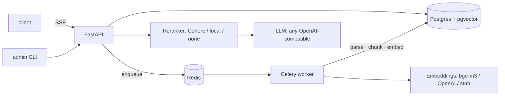

# DocQA — full documentation

The [README](README.md) covers the quick start; this file holds everything else: features, measured evaluation results, architecture, configuration and design decisions. Deployment lives in [deploy/runbook.md](deploy/runbook.md).

## What works today

**Ask questions, get grounded answers:**

- **Hybrid retrieval** — pgvector HNSW (cosine) + Postgres FTS fused with Reciprocal Rank Fusion; optional reranking (Cohere `rerank-v3.5`, local `bge-reranker-v2-m3`, or none)
- **Bounded evidence planning** — after the original question passes the unchanged retrieval gate, the configured LLM may produce up to three focused searches for a comparison or multi-part request. Each search uses the caller's access labels, and the final answer still answers the exact original question from one bounded, deduplicated context
- **Cheap honest refusals** — a standalone question or root conversation turn can be refused *before* any LLM call (the retrieval gate avoids generation cost; embeddings/reranking may still incur cost). A contextual follow-up is normalized before retrieval and can therefore incur that one LLM call even when retrieval then refuses it; a model-side `NO_ANSWER` is intercepted mid-stream and converted to a refusal (generation gate)
- **Citations that resolve** — every `[n]` maps to a document, page range, section breadcrumbs and snippet; out-of-range citations are stripped before the answer is final
- **Pinpoint quotes** — the model ends each answer with a `QUOTES:` section, one verbatim passage per cited block; the pipeline keeps it out of the streamed text and locates every quote inside its chunk (exact → normalised → fuzzy, falling back to the chunk sentence that overlaps the claim the most, numbers counting double so a translated answer still anchors). `done.citations` carries the cited blocks with their full passage and `{start, end, text}` spans; `query_citations.quotes` records them. Measured on a 40-question stratified sample of corpus v2 (judge `deepseek-chat`): the answer layer is unchanged by the extra section (faithfulness 33/33, correctness 33/33, citation precision 33/34, false refusals 1/34 in both arms) and 107 of 117 quote spans came from the model's own words (100 exact, 6 normalised, 1 fuzzy), 10 from the lexical fallback. `GET /v1/documents/{id}/passages` serves a document's chunks in reading order (role-filtered in the WHERE clause, `around=` centres a page on a cited chunk) — the surface the reader highlights
- **Conversation history** — named conversations are stored per collection for accounts and for guests with an opaque HttpOnly browser session. They can be listed, renamed, archived and paged; sign-in transfers session-owned guest conversations before rotating the cookie. Guest sessions use a bounded 30-day sliding TTL. The legacy `GET /v1/collections/{id}/queries` remains available, while UUID-only guest claiming is retired with `410 Gone` because a row id alone is not ownership proof. Trusted private-tenant API keys share that tenant's conversations; the shared public demo key never owns or reads conversations
- **Bounded follow-up context** — a follow-up may use at most four questions from its exact parent chain and six currently authorized source references within a 2,000-token safe-metadata budget. Historical answers and passage text never become evidence. Source or role changes reset inherited context; a strict one-call normalizer either produces a standalone retrieval question or asks for clarification
- **SSE streaming** — `meta → sources → delta… → done`; sources arrive *before* the first token, so you see where the answer will come from earlier than the answer. Plain JSON mode for API clients
- **Any OpenAI-compatible LLM** — one provider class covers OpenAI, DeepSeek, Ollama and vLLM via `base_url`; Anthropic planned
- **Usage accounting** — every query (refusals included) records tokens, cost, latency, the access role and its context blocks. Query token/cost fields combine the follow-up normalizer, planning, answering, and exceptional empty-answer retry calls; embedding and reranker charges remain in the provider budget ledger
- **Access-aware retrieval** — sections of a document can be restricted to a group (`Access: Finance only` in the text); every chunk carries that label and retrieval filters on it *in the WHERE clause* before ranking, so a restricted passage never reaches the prompt, the sources or the citations. The caller states its role (`role` on `POST /v1/query`, roles from `GET /v1/roles`); in demo reveal mode the response also says how many relevant passages the role could not see and which group unlocks them. Details below

**Feed it documents:**

- **Multi-tenant API** — API keys (`dqa_live_…`, sha256-at-rest, shown once), tenant-scoped resources, admin CLI
- **Document upload** — streaming multipart with on-the-fly sha256, size limit (413), magic-byte type detection (415), duplicate detection via DB constraint (409 with the existing document id)
- **Background ingestion** — Celery worker: parse → section-aware chunking (~450 tokens, 60 overlap, tables kept atomic) → embeddings → bulk insert; status `pending → processing → ready | failed`
- **Parsers** — PDF (PyMuPDF, font-size heading heuristics → section breadcrumbs), DOCX (headings + tables → Markdown), MD (a YAML front matter becomes one metadata line plus an `Access:` marker, never raw YAML in a chunk), TXT. `python -m app.cli reprocess --collection-id … [--suffix .md]` re-chunks stored files in place after a parser change — no re-upload, so neither the demo cap nor the rate limiter is involved
- **Embedding providers** — OpenAI (`text-embedding-3-small@1024`), Ollama (`bge-m3`), and a deterministic stub: tests and offline mode need zero API keys
- **Scans and photos (OCR)** — a PDF page without a text layer, or an uploaded image (PNG, JPEG, TIFF incl. multi-page, BMP, WEBP, GIF, HEIC/HEIF from phones), is recognised instead of extracted: EXIF rotation, lighting flattening, deskew and upscaling first, then Tesseract (offline, English) by default or a vision LLM on request. Headings come from line height, so section breadcrumbs and `Access:` markers work on scans too. The document reports `ocr_pages` and `ocr_confidence`, and a searchable copy with an invisible text layer is served by `GET /v1/documents/{id}/file?variant=searchable` so the reader can select and find text on a scan. See "OCR for scans and photos" below
- **Field extraction with user-defined schemas** — define a schema (`POST /v1/schemas`: named, typed fields with descriptions, examples, `required`, enum options, regex patterns, plus cross-field rules such as `abs(subtotal + tax - total) < 0.05`), then `POST /v1/documents/{id}/extractions` runs one structured LLM call over the document (whole text when short, otherwise the chunks closest to each field), coerces types deterministically (dates → ISO, `1.250,00 EUR` → 1250.0, yes/no → boolean), checks patterns, enums, required fields and rules into `issues`, and anchors every value to evidence: the quoted passage located in its chunk with the pinpoint-quote locator and, on scans, the OCR paragraph box. Values can be edited or cleared (`PATCH`), edits survive re-runs unless forced, extractions can be deleted, a schema's results export as CSV/JSON per collection, and `index_facts` writes the values as one retrievable passage so Q&A can answer "what is the total of invoice 42". See "Field extraction" below
- **Notion as a source** — `POST /v1/collections/{id}/sources` with an internal-integration token (stored Fernet-encrypted, never returned) and optional root pages/databases (ids or URLs; none = everything shared with the integration). The worker lists the workspace through the search endpoint, renders each page to Markdown (headings shifted under the page title, lists, tables, callouts, database-row properties as `key: value` lines, `Access: … only` markers preserved) and stores it like an upload, so parsing, chunking, retrieval and citations are unchanged. A re-sync (`POST /v1/sources/{id}/sync`, or `auto_sync_interval_s`) re-renders only pages whose `last_edited_time` moved, updates documents in place, removes pages that vanished, and reports `{listed, added, updated, unchanged, removed, duplicates, …}`. Deleting a source keeps its documents. See "External sources" below
- **Suggested questions:** the model drafts from public excerpts only; candidates are ranked against public retrieval. A locked starter may refer to an already-visible filename whose restricted labels are covered by an available role, never paraphrase private text. If no suitable role/file is available, no locked hint is manufactured. Suggestions refresh after ingestion/deletion and are cleared on wipe; stale tasks cannot restore pre-cleanup suggestions.
- **Ingestion progress & cost** — `GET /v1/collections/{id}/ingest-status`: document counts by status, tokens embedded so far priced at the collection's embedding model (e.g. the whole 21-doc demo corpus ≈ $0.0004 on `text-embedding-3-small`), and an ETA for in-flight documents derived from recently measured throughput

**Run it like a service:**

- **Per-key rate limiting** — Redis token bucket (atomic Lua), per endpoint class (query 30/min, upload 10/min, default 120/min); 429 with `Retry-After` and `X-RateLimit-*`; fails open when Redis is down (current outage policy; not a hard spending control)
- **Daily AI allowance** — durable $0.50 per account and guest IP, resetting at UTC midnight. Guest spending remains after login. Embeddings, answers, suggestions and retries reserve their cost before calling providers; unavailable accounting fails closed. There is no global monetary cap. See [billing](docs/billing.md).
- **Idempotency** — `Idempotency-Key` on uploads and non-streaming queries: concurrent duplicate → 409 `request_in_flight`, repeat → stored response replayed with `X-Idempotency-Replay: true`
- **Strict tenant isolation** — every query carries the tenant scope in its WHERE clause; a foreign resource is indistinguishable from a missing one (404, never 403); covered by an IDOR test matrix and a concurrent-dedup race test
- **Docker** — multi-stage uv image, non-root; `docker-compose.prod.yml` runs a migration job, api + worker + beat + Postgres + Redis with healthchecks, DB/Redis ports unpublished, `noeviction` Redis (a broker must never drop messages)
- **CI** — GitHub Actions: ruff, strict mypy, full test suite (testcontainers) with an 80% selected-module coverage gate; keyless/demo UI typecheck, build and browser tests; Dependabot for deps and actions
- **Ops hygiene** — fail-fast config, structured JSON logs with `request_id`, RFC 9457 problem+json errors everywhere, additive Alembic migrations, `/v1/usage` aggregates. The 2026-09-10 local implementation run passed 252 backend tests (90.06% selected-module coverage) plus 6 deployment tests; see the assessment for current evidence and scope

**Use it from a browser:**

- **Next.js UI** ([ui/](ui/)) — an "archivist's desk" interface: each collection's own suggested questions as starter chips (LLM-generated after ingestion; no static fallback — an empty collection shows no chips; a lock marks questions the current role cannot answer), a "Viewing as" role switch in the top bar, sources rendered *before* the answer streams (restricted passages wear their group's tag), inline citation stamps that open a source panel (file, pages, section, access, the exact quoted words in full, the passage in context, and *Open in document* — the reader's Passages view centred on the cited chunk with the quote marked in stamp blue, next to the Original file), named conversations with server-backed account and guest history, refusals as a first-class amber state — including "not available at your access level" with a one-click "View as Finance" — a library screen with upload (documents, scans and phone photos), live ingestion statuses, a *scan* tag with the OCR confidence, per-document access tags and a progress line (ETA + embedded tokens + running cost + restricted passages); a *Fields* view in the reader (pick a schema, extract, read each value with the passage it came from, *Show in document* marks it in Passages, edit or clear a value, re-run, delete) and a *Schemas* page (fields table with types, descriptions, required/enum/pattern/examples, rules, templates to start from, CSV export per collection). Scans open in the reader as their searchable PDF copy. `cd ui && npm install && npm run dev` against a running API.

## Measured, not promised

The eval tables below, including corpus v2 and public-corpus sections, are **historical measurements** for the model, corpus, prompt and retrieval settings recorded in their linked result files. They were not rerun for the unreleased readiness changes. Current defaults and the deployed provider configuration must be fixed and evaluated together before using these numbers as release acceptance or a cost guarantee.

The repo ships a synthetic corpus (21 corporate policy documents, EN+DE) with deliberately engineered traps — a version conflict, cross-document answers, an exception buried mid-section, near-duplicate policies, five guaranteed knowledge gaps — plus two golden sets:

- [eval/golden.yaml](eval/golden.yaml) — the original 30 questions (incl. 3 German)
- [eval/golden_large.yaml](eval/golden_large.yaml) — **447 English questions**: direct(167), table(40), multi-doc(40), version(30), buried(20), and 150 must-refuse questions (the five engineered gaps plus 17 grep-verified absent topics)

### Large set, full pipeline (bge-m3 retrieval, `deepseek-v4-flash` answers)

| Retrieval (recall@8) | Result |
| --- | --- |
| direct (167) | 0.99 |
| table (40) | 0.97 |
| multi-doc, all sources found (40) | 0.97 |
| version conflict (30) | 1.00 |
| buried exception (20) | 1.00 |
| **all answerable (297)** | **0.99** |

| Answer-layer metric | Result |
| --- | --- |
| End-to-end refusals on 150 off-corpus questions | 149/150 — **zero invented answers** |
| Citation precision (cited docs ∈ expected docs) | 281/282 (99.6%) |
| Faithfulness — every claim supported by retrieved excerpts (LLM-judged) | **278/278 (100%)** |
| Correctness vs the golden answer (LLM-judged) | 272/278 (97.8%) |
| False refusals on answerable questions | 18/297 (6%) |

Reading the failures, not just the rates:

- All 6 correctness misses are **faithful but incomplete** (a secondary fact dropped, or over-hedging); one traces to a retrieval miss, not generation. No hallucinations anywhere.
- 15 of 18 false refusals are $0 retrieval-gate refusals with scores 0.442–0.500 — just under the threshold; the sweep on this set recommends `REFUSAL_THRESHOLD=0.48` (97% answerable pass rate, 31% of off-corpus refused for free).
- The single off-corpus "non-refusal" returned an empty answer, not an invented one (see the DeepSeek note in Known limits).
- The 3 retrieval misses are honest limitations: `'simple'` FTS does no stemming ("project" ≠ "projects"), one table-heavy chunk lost the fusion, one multi-hop pair needed a document that never surfaced.

Details, threshold sweep and the reproduce command: [eval/results_large.md](eval/results_large.md). Judge runs use `--judge-model deepseek-chat` (the non-thinking alias of the same model — see Known limits for why).

The same 447 questions were also run end-to-end on **OpenAI `text-embedding-3-small@1024`** (the deploy configuration): recall@8 stays 0.99, faithfulness 292/292, correctness 287/292 (98.3%), citation precision 294/297, and the NO_ANSWER sentinel alone refuses 149/150 off-corpus questions with only 5/297 false refusals — the one "leak" is a correct grounded negative, not an invention. The cosine scale differs per embedding model, so the gate threshold is measured per provider: 0.28 for OpenAI vs 0.48 for bge-m3 — analysis in [eval/results_large_openai.md](eval/results_large_openai.md).

### Access levels (32-question set, OpenAI embeddings + `deepseek-v4-flash`)

[eval/golden_access.yaml](eval/golden_access.yaml) asks about the eight restricted passages (F25–F32) under roles that may and may not read them, plus three partial questions that mix an open and a restricted fact. Results ([eval/results_access.md](eval/results_access.md)):

| Access metric | Result |
| --- | --- |
| Retrieval leaks — a chunk outside the role's labels surfaced (15 restricted questions) | **0/15** |
| End-to-end leaks — an answer instead of a refusal | **0/15** |
| Reveal hint names the label that unlocks the passage | 15/15 |
| Unlock questions (asked under the right role), recall@8 | 17/17 |
| Citation precision on unlock questions | 17/17 |
| False refusals | 1/17 — a partial question (open equipment budget + restricted write-off threshold) that the model answered with `NO_ANSWER` instead of the open half |

The classic 30-question set keeps recall@8 = 1.00 under both `leadership` and `employee` — restricting sections did not disturb retrieval of the open ones.

### Original 30-question set (local `qwen2.5:7b-instruct`)

The same pipeline measured fully offline — recall@8 = 1.00 on all 25 answerable questions (incl. German → bge-m3 is multilingual), 5/5 refusals, citation precision 24/24, faithfulness 20/21, correctness 19/21. A 7B model plays it safe: 3 of its 4 false refusals were `NO_ANSWER` on paraphrase-heavy traps — the hosted rerun above reclaimed them. Details: [eval/results.md](eval/results.md).

## Architecture


```mermaid
flowchart LR
  UI[client] -->|SSE| API[FastAPI]
  CLI[admin CLI] --> API
  API --> PG[(Postgres + pgvector)]
  API -->|enqueue| R[(Redis)]
  R --> W[Celery worker]
  W -->|parse · chunk · embed| PG
  W --> EMB[Embeddings: bge-m3 / OpenAI / stub]
  API --> RER[Reranker: Cohere / local / none] --> LLM[LLM: any OpenAI-compatible]
```

- **One database** for metadata, chunks, vectors (HNSW) and full-text (`tsvector`) — transactional consistency, one thing to deploy.
- **Async SQLAlchemy** in the API, **sync** engine in the worker — Celery tasks stay loop-free.
- **Everything external is a `Protocol`** with a stub implementation — the whole test suite runs offline.

## Production-shaped stack

```bash
docker compose -f docker-compose.prod.yml up -d --build --wait
```

Set distinct `POSTGRES_PASSWORD` and `POSTGRES_APP_PASSWORD` first. One non-root application image runs the API, worker and a single beat scheduler. A separate admin migration job precedes runtime services; `docqa_app` has CRUD rights without schema ownership or role management. PostgreSQL and Redis have no published ports. The public-demo overlays, existing-volume migration, backup/restore and monitoring procedures are documented in [deploy/runbook.md](deploy/runbook.md).

### Readiness changes (unreleased, 2026-09-10)

- Apply additive migrations through **0011** before starting this version: ingestion leases, collection versions, accounts/sessions, explicit publication, durable spending and suggestion job identity. Migration 0008 clears legacy suggested questions because they may paraphrase restricted excerpts. Existing documents, chunks and queries are preserved; existing collections are never automatically published or assigned to a new account.
- Production uses [email/password accounts](docs/accounts.md) with verification, recovery, server sessions and Origin/CSRF checks. Guests can query explicitly published read-only collections; verified users upload to their private tenant. An owner can read all labels in their own files. Browser role simulation only applies to the public corpus.
- [Daily billing](docs/billing.md) retains guest usage on login, reserves paid calls before dispatch and carries ownership/IP into background jobs. Public browser API keys are rejected by account-mode UI builds. Private answers, passwords and session tokens are not persisted in browser storage; identity changes clear and cancel the entire private UI state across tabs.
- An accepted upload remains recoverable when broker publication fails. Beat republishes due pending and expired processing work every minute. Workers allow four persisted attempts, with 540/600-second soft/hard task limits and a 660-second processing lease. Terminal `failed` documents require explicit `python -m app.cli reprocess --collection-id <uuid>`; duplicate delivery does not restart them. This improves recovery, but does not promise exactly-once provider billing after a process dies.
- `DELETE /v1/documents/{id}` returns **403** for read-only collections. Public collection creation is forbidden in demo mode; operators provision collections with demo mode temporarily disabled. Parallel uploads respect the demo collection cap, and deletion/cleanup preserve originals still referenced by another collection.
- Owners can download their originals in any processing state and explicitly retry failed processing using `POST /v1/documents/{id}/reprocess`. Failed AI calls never remove originals. Public-demo original-file requests retain readiness and role checks; foreign private resources always return 404.
- Upload idempotency now binds operation, collection version, detected MIME and content. Query replay also binds the effective access policy. Reusing a key after a policy/data change or using a legacy unbound cache entry returns 422; use a fresh key. A renamed identical file with the same detected MIME remains a valid replay.
- `wipe-collection` refuses personal tenants and published collections. For an operator-owned disposable collection it removes documents/chunks/questions/citations and caches, and fences in-flight work. Personal data has no nightly wipe or automatic TTL. Explicit deletion preserves originals still referenced elsewhere. Backups require their own documented retention policy.
- Public suggested questions use public excerpts only. A locked suggestion can reference an already-visible filename without sending restricted text to the suggestion model. Personal suggestion jobs retain the actual triggering payer and revision. API responses use `private, no-store`; unexpected error logs retain correlation IDs and exception types rather than document/SQL/provider payloads.
- Local writes now flush file and directory metadata. The optional versioned S3 provider verifies originals independently of its local cache. Accounts and spending are included in consistent backup/restore, and a synchronous PostgreSQL standby deployment path is supplied. Follow [durability requirements](deploy/durability.md) before accepting private production data.
- Missing provider credentials, invalid limits and incompatible vector dimensions fail at startup. Hosted OpenAI-compatible LLM endpoints require a key; supported local endpoints may remain keyless. `TOP_K_FTS=0` still supports vector-only evaluation.
- The default answer context now accepts 40 chunks within 18,000 tokens. A targeted synthetic regression found the required historical and latest-deployment facts at ranks 30 and 33, outside the previous 20-chunk window. Historical/partial answers now explicitly preserve requested scope and withheld values. The larger context consumes more of the same daily allowance; it does not make every corpus question reliable. The eval judge uses captured original context with `--direct`, never a second retrieval presented as the original input.

Verification, including bounded real-provider synthetic-corpus runs, is recorded in [application-assessment.md](application-assessment.md). The account and privacy changes are deployed at docqa.net with SMTP, independent versioned originals, a synchronous standby and verified encrypted backups. The assessment records current release evidence and the remaining user acceptance, hosting and operator decisions.

## Configuration

Copy `.env.example` and adjust. Highlights:

| Variable | Default | Purpose |
|---|---|---|
| `DATABASE_URL` | — (required) | asyncpg DSN for the API |
| `DATABASE_URL_SYNC` | derived | psycopg DSN for the worker |
| `REDIS_URL` | — (required) | Celery broker & app cache |
| `EMBEDDING_PROVIDER` | `stub` | `stub` \| `openai` \| `ollama` |
| `EMBEDDING_DIM` | `1024` | fixed vector dimension |
| `OLLAMA_BASE_URL` | `http://localhost:11434` | for `ollama` provider (`bge-m3`) |
| `OPENAI_API_KEY` | — | for `openai` provider |
| `LLM_PROVIDER` | `stub` | `openai_compat` \| `stub` |
| `LLM_BASE_URL` / `LLM_MODEL` | OpenAI | any OpenAI-compatible endpoint (DeepSeek, Ollama `/v1`, vLLM) |
| `LLM_MAX_TOKENS` | `1024` | completion budget; raise to ~4096 if the model spends hidden reasoning tokens (see Known limits) |
| `LLM_TIMEOUT_S` | `180` | total OpenAI-compatible generation stream deadline, including heartbeat-only streams |
| `QUERY_PLANNING_ENABLED` | `true` | after the original gate passes, use the configured LLM to plan up to three access-filtered retrieval facets before answering |
| `RERANK_PROVIDER` | `none` | `cohere` \| `local` \| `none` \| `stub` |
| `REFUSAL_THRESHOLD` | `0.50` | retrieval-gate score below this → refuse without an LLM call; the scale is provider-specific (best vector cosine when `rerank=none`) — measured: `0.28` for `text-embedding-3-small@1024`, `~0.48` for `bge-m3`; retune with `eval/run_eval.py` after switching embeddings or reranker |
| `SUGGESTED_QUESTIONS_ENABLED` | `true` | LLM-drafted starter questions per collection, refreshed when ingestion settles |
| `SUGGESTED_QUESTIONS_COUNT` | `3` | how many suggested questions are kept (count+2 drafted, ranked by retrieval score) |
| `ACCESS_ROLES` | employee/manager/hr/finance/leadership | JSON map role → readable content labels; every role must include `all` (see Access-aware retrieval) |
| `ACCESS_DEFAULT_ROLE` | `employee` | role assumed when a query names none — least privilege by design |
| `ACCESS_REVEAL_HIDDEN` | `false` | demo mode: report how many relevant passages the role could not see and which labels unlock them (this confirms restricted content exists — keep it off where that matters) |
| `RATE_LIMIT_ENABLED` | `true` | per-key token buckets (query 30/min, upload 10/min, default 120/min) |
| `RATE_LIMIT_QUERY_PER_DAY` | `0` (off) | daily query quota per key+address; not a global monetary cap, and Redis failure currently fails open |
| `MAX_UPLOAD_MB` | `25` | upload size cap → 413 |
| `MAX_PAGES` | `300` | PDF page cap → 422 |
| `OCR_PROVIDER` | `tesseract` | `tesseract` \| `vision` \| `stub` — engine for image-only PDF pages and image uploads |
| `OCR_LANGUAGES` / `OCR_DPI` / `OCR_MIN_CHARS_PER_PAGE` | `eng` / `200` / `20` | Tesseract languages; rasterisation dpi; text-layer threshold below which a page is OCR'd |
| `OCR_MAX_PAGES` / `DEMO_MAX_OCR_PAGES` | `100` / `20` | recognised pages per upload (CPU-bound); the demo cap |
| `OCR_SEARCHABLE_PDF` / `OCR_DESKEW` | `true` / `true` | write the invisible-text-layer copy; run the deskew search |
| `OCR_VISION_MODEL` / `OCR_VISION_BASE_URL` / `OCR_VISION_API_KEY` | `gpt-4o-mini` / LLM defaults | the multimodal model for `OCR_PROVIDER=vision` |
| `EXTRACTION_FULL_TEXT_TOKENS` / `EXTRACTION_CONTEXT_TOKENS` | `12000` / `8000` | whole document below the first; selected chunks within the second above it |
| `EXTRACTION_MAX_FIELDS` / `EXTRACTION_MAX_TOKENS` | `30` / `2048` | fields per schema; completion budget of the structured call |
| `DEMO_MAX_EXTRACTIONS_PER_DAY` | `10` | demo mode: extractions per visitor and day |
| `SOURCE_CREDENTIALS_KEY` | — (sources off) | Fernet key encrypting source tokens at rest (`python -m app.sources.crypto` prints one) |
| `SOURCE_MAX_DOCUMENTS` / `SOURCE_MAX_PER_COLLECTION` | `500` / `5` | pages per source and sync; sources per collection |
| `SOURCE_SYNC_SCHEDULE_S` | `300` | beat cadence that enqueues due auto-sync sources |
| `NOTION_BASE_URL` / `NOTION_API_VERSION` | `https://api.notion.com` / `2022-06-28` | Notion API endpoint and version header |

## Design decisions

- **pgvector in the main DB, not a dedicated vector store** — transactional with metadata, one instance to run; HNSW is plenty at this scale (see Known limits).
- **RRF instead of weighted score fusion** — cosine similarity and `ts_rank` live on incomparable scales; RRF works on ranks alone, needs no normalization or weight tuning, and a chunk found by both searches naturally rises to the top.
- **Refusals are engineered, not hoped for** — two gates: retrieval (top rerank score below threshold → refuse without a generation call) and generation (the model's `NO_ANSWER` is buffered and intercepted before a single token reaches the client).
- **Evidence planning is post-gate and bounded** — the original query alone controls the retrieval gate and its confidence. After it passes, one same-model planning call can add at most three sequential, access-filtered retrieval attempts; the original plus facets are merged round-robin under the existing context limits. A successful query usually makes two LLM calls (planner plus answer). If the first answer produces no visible text after consuming its stream, the pipeline repeats that answer once over the frozen context, for an exceptional maximum of three LLM calls and four retrieval attempts. The planner uses the configured `LLM_MAX_TOKENS` because providers can spend that budget on hidden reasoning, so even a valid empty plan adds provider latency and a separate LLM charge.
- **Sources stream before the answer** — the user sees *where* the answer will come from before the answer itself; trust is the product.
- **Fixed 1024-dim embeddings** — native for `bge-m3`, supported by OpenAI via matryoshka `dimensions=1024`; one column covers all providers, `collections.embedding_model` prevents mixing.
- **Dedup via unique constraint, not SELECT-then-INSERT** — the DB wins the race; concurrent identical uploads yield exactly one document and a 409.
- **`tsvector` with the `'simple'` config** — the corpus is bilingual (EN/DE); language-specific stemming would break one of them. FTS supplies exact matches (IDs, numbers); semantics is the vector's job.
- **Foreign tenant's resource → 404, not 403** — a 403 confirms the resource exists; that's an information leak.
- **Parser errors don't retry** — the file will not become more valid; transient (network/provider) errors retry with exponential backoff.
- **`rerank=none` for the demo is a decision, not a gap** — recall@8 is 0.99 on the 447-question set and the cosine gate separates off-corpus questions, so a cross-encoder would add latency and an API key for little measurable gain at this scale. The pluggable path stays ready (Cohere `rerank-v3.5` or local `bge-reranker-v2-m3`); switching providers means retuning `REFUSAL_THRESHOLD` with `eval/run_eval.py` — rerank score scales differ.
- **Query stats survive disconnects** — recording runs in a cancellation-shielded `finally`; a closed laptop lid doesn't lose usage data.
- **Access control is a retrieval filter, not an answer filter** — see the next section.

## OCR for scans and photos

Everything after recognition is the normal pipeline: OCR produces the same `ParsedPage` blocks the PDF parser does, so chunking, access labels, retrieval and pinpoint citations do not know a page was a photo.

- **When** — a PDF page with fewer than `OCR_MIN_CHARS_PER_PAGE` (20) extracted characters that carries an image is rasterised at `OCR_DPI` (200) and recognised; pages with a text layer keep the fast path, so a mixed document is handled page by page. Every uploaded image is a document; a multi-frame TIFF/GIF is one page per frame. `OCR_MAX_PAGES` (100, `DEMO_MAX_OCR_PAGES` = 20 in demo mode) caps recognised pages per upload because OCR is CPU-bound (1–3 s per page on the ARM host).
- **Preprocessing** (`app/ingestion/ocr/preprocess.py`, Pillow + NumPy) — EXIF orientation, grayscale, lighting flattening (divide by a wide blur: removes the shadow gradient of a phone photo), auto-contrast, deskew (projection-profile search ±15°, applied only when aligned text produces a sharp peak), 2× upscale below 1500 px. The transform is kept so boxes can be mapped back.
- **Engines** (`OCR_PROVIDER`) — `tesseract` (default; the `tesseract-ocr` + `tesseract-ocr-eng` packages are in the Docker image; page segmentation auto with a single-block fallback for dense photos, orientation detection for 90° shots; paragraph blocks with boxes and confidences), `vision` (an OpenAI-compatible multimodal model transcribes the page to Markdown — best structure, no geometry, paid per page through the budget ledger, and the image leaves the server, so it stays off in the demo), `stub` (tests). Adding a cloud OCR is one class behind the `OcrProvider` Protocol.
- **Headings without fonts** — a block whose line height exceeds the page's character-weighted median by 25%, short, not sentence-like, is a heading; levels by clustering heights across the document (max 3), as for PDFs.
- **Searchable copy** — the worker writes the original pages with the recognised words drawn invisibly at their boxes (`documents.searchable_sha256`; `?variant=searchable` on the file route; removed with the document). On a deskewed photo the layer is placed by scale only, good for select/search, not pixel-exact.
- **Measured** — `eval/results_ocr.md` (`uv run python -m eval.ocr.run_ocr_eval`): ten corpus policies typeset, rasterised and degraded as scan / skewed+noise / phone photo, word error rate and heading recall per variant.

## Field extraction

Schemas belong to the tenant and are whatever the user needs (`GET /v1/schemas/templates` offers an invoice and a contract as copyable examples). A field is `{name, type, description, required, enum_values, pattern, examples}` with `type` one of string, number, integer, date, boolean, enum, array; rules are small expressions over field names (`+ - * /`, comparisons, `and/or/not`, `in`, `sum len min max abs round`, ISO dates compare as strings) validated at schema creation, evaluated after coercion, and *unknown* rather than failed when an operand is missing.

One extraction per (document, schema). The worker (`extraction.run`):

1. **Context** — chunks in reading order when the document is under `EXTRACTION_FULL_TEXT_TOKENS` (12k); otherwise each field becomes a query, the document's own chunks are scored by cosine in memory and the best are kept within `EXTRACTION_CONTEXT_TOKENS` (8k), the first chunk always (headers carry identifiers).
2. **Structured call** — `LLMProvider.complete_json` asks for `{"fields": {name: {"value", "quote"}}}` with a JSON Schema derived from the fields (`response_format: json_schema`, falling back to `json_object` with the schema in the prompt for providers that reject it; one repair round for invalid JSON). Temperature 0, `EXTRACTION_MAX_TOKENS` (2048). Cost goes through the budget ledger and is recorded on the extraction (`prompt_tokens`, `completion_tokens`, `cost_usd`).
3. **Validation** — coercion per type, `pattern`, `enum_values`, `required`, then the rules; every failure is an issue `{field, code, message}` (`type_mismatch`, `enum_mismatch`, `pattern_mismatch`, `missing_required`, `rule_failed`, `rule_error`, `evidence_not_found`), never a lost value.
4. **Evidence** — the quote (else the value itself) is located in a chunk (exact → normalised → fuzzy); on OCR'd pages the paragraph box that carries it is attached (`bbox` in the prepared-image space with `page_size`). Confidence: 0.9 quote found and value in it, 0.75 quote found, 0.6 only the value found, 0.4 nothing found.
5. **Facts passage** — with `index_facts`, the values are embedded as one extra chunk (`section_path` "Extracted fields") labelled with the document's restricted label (fail-closed when there are several), so retrieval and citations reach them; replaced on re-run, removed with the extraction or the schema.

`PATCH /v1/extractions/{id}` sets values (`edited: true`, confidence 1.0) or clears them; a re-run keeps edited fields unless `force`. `GET /v1/collections/{id}/extractions?schema_id=&format=csv|json` gives one row per document. Everything is owner-only and tenant-scoped (foreign ids read as 404); in demo mode `DEMO_MAX_EXTRACTIONS_PER_DAY` (10) per visitor. Measured cost on `deepseek-v4-flash`: a 2–8k-token document is roughly $0.001–0.004 per extraction.

## External sources (Notion)

A **source** belongs to one collection and turns an external workspace into ordinary documents (`documents.source_id`, `external_id`, `external_url`, `external_version`). Everything after rendering is the upload path: the Markdown is content-addressed in storage, `ingest_document` parses and chunks it, retrieval and citations do not know where a document came from.

Set `SOURCE_CREDENTIALS_KEY` (a Fernet key: `uv run python -m app.sources.crypto`) — without it the endpoints answer `503 sources_disabled`. Create a Notion internal integration, share the pages or databases with it, then:

```bash
curl -X POST $API/v1/collections/$COLLECTION/sources -H "Authorization: Bearer $KEY" \
  -H 'Content-Type: application/json' \
  -d '{"kind": "notion", "name": "Company wiki", "token": "ntn_…",
       "root_ids": ["https://www.notion.so/acme/Handbook-1a2b3c…"], "auto_sync_interval_s": 3600}'
```

- **Listing** uses `POST /v1/search` (every page and database the integration can see, with `last_edited_time` and parent), filtered to the pages whose ancestor chain reaches a root; database rows are pages and become one document each; archived pages count as removed. Only pages changed since the last sync are rendered (`GET /v1/blocks/{id}/children`, recursively), at Notion's 3 requests/second with `Retry-After` honoured.
- **Rendering** — page title `#`, `heading_n` → `#` × (n+1) so breadcrumbs read *Page > Section*; lists nest by indentation; tables become Markdown tables (kept atomic by the chunker); callouts are plain paragraphs so an `Access: leadership only` callout labels its section exactly like in a PDF; child pages are not inlined (they are documents of their own, a `Sub-page: …` line keeps the relation readable).
- **Sync semantics** — one transaction per document; a soft time limit marks the source `partial` and re-enqueues it; two pages that render to identical text collide on `(collection_id, sha256)` and the second is counted under `duplicates`; a page above `MAX_UPLOAD_MB` or beyond the account storage limit is skipped and counted; a source in `queued`/`syncing` with a live lease answers `409 source_sync_in_progress`. `sources.schedule` (beat, every `SOURCE_SYNC_SCHEDULE_S`) enqueues due auto-sync sources and re-publishes queued rows whose lease expired.
- **Limits** — `SOURCE_MAX_DOCUMENTS` pages per source and sync (500), `SOURCE_MAX_PER_COLLECTION` (5). Guests and read-only/public collections cannot create sources; sources are owner-only (a foreign source is a 404).

## Access-aware retrieval

Real corporate documents mix audiences: the expense policy everyone reads has a card-limit section only Finance should see; the offboarding checklist has a for-cause procedure meant for managers. DocQA models that at the level it actually occurs — the **section**, not the document.

**Labels and roles are two different vocabularies.** A *label* classifies content (`all`, `managers`, `hr`, `finance`, `leadership`). A *role* describes who is asking (`employee`, `manager`, `hr`, `finance`, `leadership`). `ACCESS_ROLES` maps each role to the labels it may read; the map is a partial order on purpose — HR and Finance are siblings, not rungs of one ladder — so "Finance sees HR content" never happens by accident.

**Where labels come from.** A visible line right after a heading — `Access: Managers only`, `Zugriff: nur Finanzen` — labels that section and its sub-sections until the next heading of the same or a higher level; a marker before the first heading labels the whole document. The marker stays in the text (the model reads it like a person would). This is what real documents look like, it is deterministic, and it survives PDF/DOCX rendering. An unknown group name fails **closed** (the section becomes `leadership`) with a warning; the per-label counts on `ingest-status` make such mistakes visible.

**Where filtering happens.** In the `WHERE` clause of both searches (`chunks.access_label IN (:labels)`), before ranking, fusion and reranking — the same discipline as tenant isolation. Post-filtering was rejected: it would let restricted text into the candidate set and into the prompt. Two consequences follow: a chunk carries exactly one label, so the chunker never merges neighbouring sections with different labels (the leak that would otherwise happen silently); and a role that sees a small slice of the corpus still gets a full `top_k`, because HNSW scans iteratively (`hnsw.iterative_scan = relaxed_order`, pgvector ≥ 0.8) instead of stopping after `ef_search` candidates.

**Who asserts the role.** The API key identifies a trusted client (an integrator's backend); `role` on the query is that client's claim about its end user, exactly as with any RAG API behind an identity provider. A missing role resolves to the least-privileged one — never to "everything". Binding allowed roles to the key is the natural hardening step and is not implemented.

**The 403-versus-404 trade-off, made explicit.** Everywhere else DocQA answers a foreign resource with 404, because a 403 confirms it exists. For access-filtered retrieval the honest default is the same: an employee asking about salary bands gets "not in the documents". A demo that behaves that way looks broken, so `ACCESS_REVEAL_HIDDEN=true` adds one extra vector query over the *complement* of the role's labels and reports only a count and the labels involved — never content. A hidden passage counts when it scores at least as well as the best passage the role can see (minus a small margin) and above the refusal threshold, so the hint names the group that actually holds the answer rather than every restricted section loosely related to the question. The UI turns that into "3 passages are restricted to Leadership — view as Leadership". Production deployments that must not confirm existence leave the flag off; the response then carries `hidden_passages: null`.

- **Query replay is access-aware:** its fingerprint includes operation, collection data version, role, effective labels, hidden-access policy and question. Upload replay binds operation, collection version, detected MIME and bytes. Old or mismatched keys return 422 instead of reusing an answer or upload from another context.

**The original file follows the same labels.** Pending, processing and failed documents return 409 until classification succeeds.  `GET /v1/documents/{id}/file?role=…` refuses a file that holds any section the role may not read (403 `document_restricted`, naming the label) — a PDF cannot be served in part. The Library still lists every document with its labels (the inventory is not secret, and the listing is what tells a manager which documents exist), but the reader is locked for restricted ones. Uploads and deletion are not role-scoped.

## Corpus v2: a 300-document company, generated facts-first

The 21-document Kranich corpus saturates retrieval (recall@8 = 0.99: top-8 is 13% of the corpus). Corpus v2 is the same fictional company at realistic scale — **298 documents, ~230k words, EN + DE in one collection** — built so that every number in it is traceable to a registry and the golden set is derived from that registry rather than written by hand.

**How it is made** ([scripts/corpus_v2/](scripts/corpus_v2/), sources in [corpus/large/](corpus/large/)):

1. `spec.py` describes the world: 28 policies with 1–3 versions each (older versions carry older values, some without a "superseded" banner), six country handbooks with the same structure and different figures, per-year rate sheets, HR/Finance/Security/Engineering/Operations guides, leadership memos, meeting notes whose decisions change over time, FAQs (six of them stale, still quoting an old value), customer-facing pages and 30 German mirrors. `make_spec.py` materializes `facts.yaml` (218 facts; pinned v1 values where the topics overlap, seeded random values elsewhere, unique per unit so a figure traces to one fact) and `manifest.yaml` (which facts, sections, access labels and cross references each document carries).
2. `generate.py` writes one document per LLM call (`deepseek-chat`) from the document's own fact slice; the model never sees the rest of the registry. `validate.py` rejects a draft when a value is missing from its section, a value of *another* document appears, any digit outside the whitelist appears (section numbers, ids, versions, dates, years), a forbidden topic is mentioned, a marker is misplaced or the length is off — and the findings go back into the prompt for up to three regenerations. German mirrors translate the accepted English text with German number formatting.
3. `make_golden.py` derives `eval/golden_v2.yaml`: two paraphrased questions per fact (the LLM sees one fact at a time and may not use digits), expected sources from the manifest, categories from fact metadata — `direct`, `table`, `version` / `version_history`, `buried`, `distractor_country`, `multi_doc` (cross references), `stale_faq`, `as_of_date`, `german`, `access` (refuse/unlock pairs), `partial`, and grep-verified `no_answer` questions about topics that do not exist in the corpus.
4. `build_corpus.py --src corpus/large/docs --manifest …` renders PDF/DOCX/MD by family; `seed.py` uploads the build through the API into the `kranich` collection.

**Traps at scale:** version conflicts across 28 policies, cross-document references without values, exceptions buried in long handbooks, the same tables per country and per year, stale FAQs that contradict the current policy, meeting decisions superseded by later meetings, restricted sections and fully restricted documents.

### Measured on corpus v2

Retrieval layer, 602 answerable questions (of 828), asked as `leadership` so nothing is filtered; every question is a paraphrase without digits, so exact-match signals are deliberately weak ([eval/results_v2_A_vector_only.md](eval/results_v2_A_vector_only.md), [eval/results_v2_B_hybrid.md](eval/results_v2_B_hybrid.md), [eval/results_v2_D_hybrid_top12.md](eval/results_v2_D_hybrid_top12.md), [eval/results_v2.md](eval/results_v2.md)):

| Category (questions) | vector only, top-8 | hybrid, top-8 | hybrid, top-12 | hybrid, top-20 (deploy config) |
| --- | --- | --- | --- | --- |
| direct (142) | 0.95 | 0.95 | 0.96 | 0.97 |
| table (16) | 0.62 | 0.62 | 0.81 | 1.00 |
| multi-doc, all sources found (80) | 0.82 | 0.82 | 0.89 | 0.99 |
| version, current value (52) | 0.94 | 0.94 | 1.00 | 1.00 |
| version history, old value (24) | 0.79 | 0.79 | 0.88 | 1.00_history |
| stale FAQ vs policy (6) | 0.67 | 0.67 | 1.00 | 1.00 |
| as-of-date meeting decisions (12) | 0.67 | 0.67 | 0.75 | 0.92 |
| country variants (84) | 1.00 | 1.00 | 1.00 | 1.00 |
| German (78) | 1.00 | 1.00 | 1.00 | 1.00 |
| access, unlocked (90) | — | 0.99 | 1.00 | 1.00 |
| **all answerable** | **0.92** | **0.93** | **0.96** | **0.99** |

Reading it: the 21-document corpus hid the retrieval window entirely (top-8 was 13% of the corpus); at 1,165 chunks the window is the lever. Tables lose most at top-8 because six country supplements and three policy versions crowd out the one rate sheet that holds the current figure; the same crowding hits version history and meeting decisions. Hybrid retrieval equals vector-only here to the last digit — the golden set forbids digits and shared keywords in questions, which is exactly the regime where FTS has nothing to anchor on (on v1's ID- and number-bearing questions it mattered). Country variants and German mirrors are solved by the embedding alone.

**Full pipeline** (hybrid, top-20, `deepseek-v4-flash`, judge `deepseek-chat`; 828 questions, [eval/results_v2.md](eval/results_v2.md)):

| Answer-layer metric | Result |
| --- | --- |
| Faithfulness — every claim supported by the retrieved excerpts (LLM-judged, 582 answered) | **580/582** |
| Correctness vs the golden answer (LLM-judged) | 570/582 (97.9%) |
| Citation precision (cited docs ∈ expected docs) | 596/602 |
| False refusals on answerable questions | 20/602 (3.3%) |
| Off-corpus questions (136): refused | 106/136 — the other 30 got a *grounded* answer (mileage rules when asked about a "car allowance", the learning budget when asked about tuition); the judge found **1** of the 36 answered off-corpus questions unfaithful |
| Access: restricted values appearing in any answer | **0/90** |
| Access: chunks outside the role's labels retrieved | **0/102** |
| Access: answered from open content instead of refusing (no restricted value involved) | 6/90 |
| Access: reveal hint names the unlocking group | 95/102 |

Two things v1 could not show. First, the retrieval gate threshold is a property of the corpus, not only of the embedding model: on the same `text-embedding-3-small` the sweep recommends `0.46` here versus `0.28` on the 21-document set, because a dense corpus always has *something* near an off-corpus question (mean gate score of unanswerable questions: 0.46 vs 0.38); at the deployed 0.28 the gate refuses almost nothing for free and the `NO_ANSWER` sentinel carries the load — still with zero invented rules. Second, "refused" is the wrong yardstick for off-corpus questions once the corpus is rich: the honest metric is *faithfulness of what was answered*, which is why the harness now judges those answers too.

The seven remaining top-20 misses are informal documents losing to formal ones on the same topic: all-hands notes stating the headcount or the NPS rank below FAQs and handbooks that discuss the same subject without the figure, and one meeting decision outranked by a later meeting on a neighbouring topic.

## Public corpora: GitLab Handbook, GovReport, CUAD, FinanceBench

The demo also carries four collections of **real** documents — 9,461 files, ~295k chunks —
so the interface can be exercised against text nobody engineered for it: the GitLab
handbook (3,639 pages), 4,979 US congressional research reports, 509 commercial contracts
(CUAD, CC-BY-4.0) and 334 SEC filings (FinanceBench, Apache-2.0). The last two ship with
expert annotations, which yielded two more golden sets without hand-writing questions:
[eval/golden_cuad.yaml](eval/golden_cuad.yaml) (130 clause questions) and
[eval/golden_financebench.yaml](eval/golden_financebench.yaml) (140 of the 150 published
questions).

| | CUAD (509 contracts) | FinanceBench (334 filings) |
| --- | --- | --- |
| Recall (expected document in the retrieved chunks) | **0.98** | 0.89 |
| Citation precision | **98%** | 88% |
| Faithfulness (LLM-judged) | 84/87 (97%) | 68/70 (97%) |
| Correctness vs the expert answer | 78/87 (90%) | 61/70 (87%) |
| Refused instead of answering | 33% | 50% |

These numbers are lower than the synthetic sets above, and that is the point of having
them. Two findings came out of the gap, both documented in
[eval/results_financebench.md](eval/results_financebench.md) and
[eval/results_cuad.md](eval/results_cuad.md):

- **The pipeline was retrieving the evidence and then cutting it off.** With eight chunks
  and a 3,600-token context budget, the expected document sat *just below the cut* for 40
  of 140 finance questions while only 3 were missing from retrieval entirely. Widening the
  window (`top_k` 30→100, `rerank_top_n` 8→20, context 3,600→9,000) moved FinanceBench
  recall 0.70→0.89 and CUAD 0.87→0.98, and cut refusals by 10 and 13 points. Widening the
  *search* costs nothing measurable (1,673 ms at `top_k=100` vs 1,693 ms at 30); the added
  latency is entirely the larger prompt, and the per-query cost roughly tripled — which is
  why the demo's daily quota moved 900→600 (and 600→50 when DeepSeek's V4 pricing landed).
- **A quarter of FinanceBench is not a retrieval task.** Where the expected number never
  surfaces, it usually does not exist in the filing: the answers are derived metrics
  (quick ratio, per-share figures) an analyst computes from balance-sheet lines. This
  system answers what documents *say*, with a page reference, and refuses otherwise — so
  those count as refusals and are deliberately not "fixed".

A cross-encoder reranker would address about 16% of the finance questions (measured: the
share whose answering chunk is retrieved but ranks below the cut), at the price of a second
paid API on the query path. The pluggable path is in the code (`RERANK_PROVIDER`); it is
not enabled here.

## Known limits

- pgvector/HNSW is the right tool up to roughly ~10M vectors; beyond that, revisit (partitioning or a dedicated vector DB).
- Files are stored on local disk behind a `StorageProtocol` — S3/MinIO is a drop-in later, not a rewrite.
- Heading detection in PDFs is heuristic (font-size clustering); exotic layouts degrade gracefully to flat chunking.
- **DeepSeek `v4-flash` hidden reasoning** — the model non-deterministically spends completion tokens on reasoning the OpenAI-compatible stream carries outside `content`; with a tight `LLM_MAX_TOKENS` this can exhaust the budget and yield an empty answer (measured: 2 of 447 eval queries at 1024). The demo keeps `LLM_MAX_TOKENS=4096`, but one comparison diagnostic still spent all 4096 completion tokens, about 17.1 seconds and $0.005013, before returning no visible plan. That measurement illustrates latency and cost; it is not a cap. Planning then safely falls back to the original retrieval. An empty answer gets one same-model retry over the frozen context, which can add another full call and still fail; a second empty result is reported as a retryable provider error rather than a blank answer.
- **Grounded comparisons need comparable evidence** — planning can recover reported evidence split across entities, periods, countries, versions or scopes, but it does not create missing facts or add an arithmetic engine. The answer must name the supported measure and cite each side. Missing, inaccessible, inconsistent or non-comparable evidence yields a supported partial answer or an honest refusal; it is never filled from outside knowledge.
- `'simple'` FTS does no stemming by design (bilingual corpus) — singular/plural mismatches occasionally cost a retrieval hit; the vector side usually covers them.

## Roadmap

- **Live demo** — VPS deploy behind Caddy (runbook ready)
- **Nice-to-haves** — provider-level thinking toggle for DeepSeek, Anthropic streaming provider, Prometheus metrics, Sentry

### Personal document storage

Browser accounts can keep any number of original documents within **50 MB
(52,428,800 bytes) per account**, summed across all their collections. Pending,
processing and failed documents count too. Deleting a document frees its logical
space; no existing document is removed automatically when the allowance is full.
Copies in different collections count separately. Backups and derived embeddings
are outside this original-file allowance. Existing per-file and processing limits
still apply. `GET /v1/storage` requires an account session and returns `used_bytes`,
`limit_bytes`, `remaining_bytes` and `document_count`. Further uploads above the
limit return413 `storage_quota_exceeded`.

### Restoring invalidated starter questions

Migration0008 intentionally clears old suggested questions for access isolation.
For previously ingested collections, regenerating them requires an explicit call
to the existing `generation.suggest_questions` worker task; migration does not
make paid provider calls. Before a repair, select only intended active collections
with missing questions, ready documents and no ingestion in flight. Pass their
current `suggestions_revision`, retain the current sanitizer and access filters,
and budget the provider calls. Do not restore pre-migration question text or
reprocess/reseed the original documents solely to recreate suggestions. Verify
three questions per repaired set and unchanged document counts afterward.
